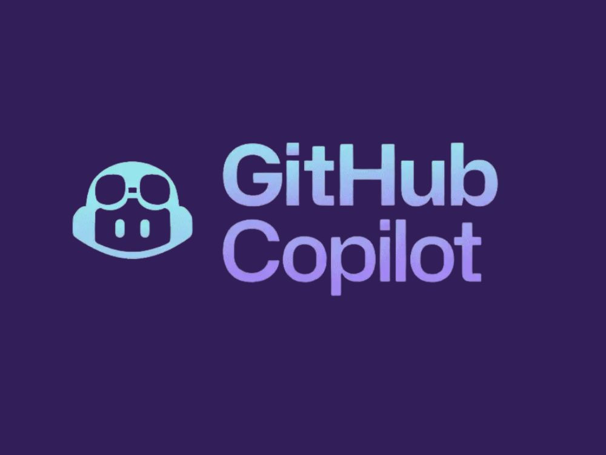

# GitHub Copilot Adoption



GitHub Copilot Adoption helps your team **drive real work outcomes** with GitHub Copilot, then build lasting adoption across your organization. Choose from **30 worked-example challenges** that demonstrate proven outcome patterns, or bring your own app and run a GitHub Copilot Adoption delivery session on your own codebase.

Each session includes repository instructions, custom agents, and custom skills
tailored to the work.

## Two Ways to Run a GitHub Copilot Adoption Delivery Session

### Option 1: Pick a Worked-Example Challenge

Choose one of the **30 challenge tracks** below. Each challenge maps to a specific business outcome and provides starter code, a devcontainer, and a progression path through real work. Use these to learn outcome-driven AI-assisted development patterns you can apply to your own work.

### Option 2: Bring Your Own Challenge

Run a GitHub Copilot Adoption delivery session on your own app or repository. The **[Bring Your Own Challenge (BYOC) kit](./byoc/)** provides a canvas to define your target outcome, templates to author a custom challenge, and a facilitator runbook to guide your session. This turns the session into working time that delivers a measurable result for your team.

See **[byoc/README.md](./byoc/README.md)** for the full kit.

## Overview

The repository includes **30 challenge tracks** organized by the outcomes they help you deliver:

### Challenges by Outcome

Each challenge below drives a measurable business outcome -- shipping features, modernizing legacy systems, raising quality, automating delivery, standing up platform foundations, or building AI-powered capabilities. Delivering that outcome is what makes the case for wider Copilot adoption.

- 📋 **[Challenge 0: Product Planning Track](./tracks/challenge-0-product-planning-track.md)** - Product planning, backlog management, documentation (no code) | **Outcome:** Ship Product Features Faster
- 🔧 **[Challenge 1: Web API Track](./tracks/challenge-1-web-api-track.md)** - REST APIs, authentication, testing | **Outcomes:** Ship Product Features Faster, Raise Quality and Confidence
- 📊 **[Challenge 2: ML & AI Track](./tracks/challenge-2-ml-ai-track.md)** - Data analysis, ML models, feature engineering | **Outcome:** Build AI-Powered Capabilities
- ☁️ **[Challenge 3: DevOps Track](./tracks/challenge-3-devops-track.md)** - Infrastructure as Code, containers, CI/CD | **Outcomes:** Automate Delivery and Ops Toil, Stand Up Cloud Platform Foundations
- 🎨 **[Challenge 4: Frontend Track](./tracks/challenge-4-frontend-track.md)** - React, TypeScript, modern UI | **Outcomes:** Ship Product Features Faster, Raise Quality and Confidence
- 🔍 **[Challenge 5: QA & Testing Track](./tracks/challenge-5-qa-track.md)** - AI-assisted testing, test planning, Copilot for QA workflows | **Outcome:** Raise Quality and Confidence
- 🤖 **[Challenge 6: Agentic Workflows Track](./tracks/challenge-6-agentic-workflows-track.md)** - Build AI-powered repository automation with GitHub Agentic Workflows | **Outcomes:** Automate Delivery and Ops Toil, Build AI-Powered Capabilities
- 🧩 **[Challenge 7: Copilot SDK Track](./tracks/challenge-7-copilot-sdk-track.md)** - Build a Copilot SDK application (advanced) | **Outcome:** Build AI-Powered Capabilities
- ✈️ **[Challenge 8: Flight Delay Predictor Track](./tracks/challenge-8-flight-delay-track.md)** - Full-stack ML app (advanced) | **Outcomes:** Ship Product Features Faster, Build AI-Powered Capabilities
- 🏢 **[Challenge 9: Cross-Functional Team Sprint](./tracks/challenge-9-team-sprint-track.md)** - Full team agile sprint, ideation to deployment (4-6 people) | **Outcome:** Ship Product Features Faster
- 🥾 **[Challenge 10: Technical Team Sprint](./tracks/challenge-10-tech-sprint-track.md)** - Technical team sprint from spec to deployment (2-4 developers) | **Outcome:** Ship Product Features Faster
- 🏦 **[Challenge 11: Legacy MUMPS Modernization](./tracks/challenge-11-mumps-modernization-track.md)** - Reverse-engineer and translate a MUMPS banking system (solo, advanced) | **Outcome:** Modernize Legacy Systems
- 🔄 **[Challenge 12: Legacy Code Modernization](./tracks/challenge-12-legacy-modernization-track.md)** - Reverse-engineer and modernize an undocumented Java application | **Outcome:** Modernize Legacy Systems
- 📄 **[Challenge 13: Living Documentation](./tracks/challenge-13-living-docs-track.md)** - Automate javadoc, diagrams, changelogs, and PR doc reviews | **Outcomes:** Raise Quality and Confidence, Automate Delivery and Ops Toil
- 🔩 **[Challenge 14: Pipeline Factory](./tracks/challenge-14-pipeline-factory-track.md)** - Build CI/CD pipelines, debug broken deployments, generate runbooks | **Outcome:** Automate Delivery and Ops Toil
- 📝 **[Challenge 15: Backlog Generator](./tracks/challenge-15-backlog-generator-track.md)** - Convert requirement specs into structured backlogs with MCP | **Outcomes:** Ship Product Features Faster, Automate Delivery and Ops Toil
- 🖥️ **[Challenge 16: Ops Assistant](./tracks/challenge-16-ops-assistant-track.md)** - Build AI-assisted log analysis, incident routing, and ops tooling | **Outcome:** Automate Delivery and Ops Toil
- 🚀 **[Challenge 17: Spec-to-Ship Accelerator](./tracks/challenge-17-spec-to-ship-track.md)** - Full lifecycle from functional spec to deployed code | **Outcomes:** Ship Product Features Faster, Automate Delivery and Ops Toil
- 🏗️ **[Challenge 18: COBOL Banking Modernization](./tracks/challenge-18-cobol-modernization-track.md)** - Reverse-engineer and modernize a COBOL banking system into a full-stack web app | **Outcome:** Modernize Legacy Systems
- 🔧 **[Challenge 19: WCF Banking Modernization](./tracks/challenge-19-wcf-modernization-track.md)** - Understand a legacy WCF SOAP banking service and migrate it to a REST API | **Outcome:** Modernize Legacy Systems
- 💻 **[Challenge 20: PowerShell Automation](./tracks/challenge-20-powershell-automation-track.md)** - Fix, test, document, and package PowerShell scripts for real sysadmin work | **Outcomes:** Automate Delivery and Ops Toil, Modernize Legacy Systems
- ☁️ **[Challenge 21: Azure Terraform Track](./tracks/challenge-21-azure-terraform-track.md)** - Build an Azure Terraform foundation with modules, identity, policy checks, and CI guardrails | **Outcome:** Stand Up Cloud Platform Foundations
- 🔍 **[Challenge 22: Secure Release Review](./tracks/challenge-22-secure-release-track.md)** - Review and harden a .NET release candidate with evidence-based security gates | **Outcome:** Raise Quality and Confidence
- 🧩 **[Challenge 23: Merger Integration Architecture](./tracks/challenge-23-merger-architecture-track.md)** - Define Azure system boundaries, integration contracts, and transition decisions after a merger | **Outcome:** Stand Up Cloud Platform Foundations
- 📊 **[Challenge 24: Peak-Load Database Rescue](./tracks/challenge-24-database-rescue-track.md)** - Tune SQL Server safely and validate an Azure SQL-compatible migration | **Outcomes:** Raise Quality and Confidence, Stand Up Cloud Platform Foundations
- ☁️ **[Challenge 25: Enterprise API Guardrails](./tracks/challenge-25-api-guardrails-track.md)** - Govern APIs with Azure API Management policies, contract checks, and onboarding controls | **Outcomes:** Automate Delivery and Ops Toil, Stand Up Cloud Platform Foundations
- 📋 **[Challenge 26: Developer Onboarding Repair](./tracks/challenge-26-developer-onboarding-track.md)** - Repair task documentation and add checks for links, commands, and examples | **Outcomes:** Raise Quality and Confidence, Automate Delivery and Ops Toil
- 🎨 **[Challenge 27: Offline Field Service App](./tracks/challenge-27-offline-mobile-track.md)** - Build a dependable React Native workflow for intermittent connectivity | **Outcomes:** Ship Product Features Faster, Raise Quality and Confidence
- 📋 **[Challenge 28: Work IQ Workplace Assistant](./tracks/challenge-28-work-iq-workplace-assistant-track.md)** - Build a permission-aware workplace handoff using Microsoft Work IQ and GitHub Copilot CLI | **Outcomes:** Automate Delivery and Ops Toil, Ship Product Features Faster
- 🔧 **[Challenge 29: Inherit and Evolve an Application](./tracks/challenge-29-inherit-and-evolve-track.md)** - Understand a working .NET equipment-booking app, fix a cancellation defect, and add a waitlist | **Outcomes:** Ship Product Features Faster, Raise Quality and Confidence

**[View All Tracks & Choose Yours](./tracks/README.md)**

Coaches who need a focused workshop path can use the site's Challenge Set Builder and Learning Paths pages to select challenges and generate a single shareable student URL.

Each track provides its own stage progression with specific guidance, tips, and
learning objectives.

The documentation site also groups challenges into 13 enterprise Role
Collections. Use the **Roles** page to find relevant work for product,
engineering, data, security, database, documentation, mobile, platform,
operations, QA, and architecture roles.

## Duration

Duration varies by track. Challenge 29 takes **4-6 hours**, with a five-hour core.
Check the selected track for its time budget.

## Documentation Site

The repository includes a bespoke static documentation site in the `web/` directory. The site is dependency-free and built with vanilla HTML, CSS, and JavaScript.

To build the site data locally:

```bash
node web/build.js
```

This reads `challenges/*/meta.yml`, `learning-paths.json`,
`role-collections.json`, and track markdown files, then writes the site data to
`web/assets/data/`.

Role Collections are curated challenge groups, not required sequences.
`role-collections.json` is their source of truth. The build rejects unknown
challenge IDs, duplicate role entries, empty collections, and challenges that
are not assigned to any role.

Each challenge is published as a set of pages rather than one concatenated guide:

- The track file becomes the main overview.
- The committed `stages.md` file becomes the contents page.
- Each stage has its own page.
- Challenges with role-specific instructions include those pages beneath their
  parent stage.

The challenge page shows this structure in a right-side **Challenge pages**
menu. Every page has a direct URL in the form
`challenge.html?id=<id>&page=<page-id>`.

The generated `platform.json` catalog includes the page manifest for each
challenge. Markdown payloads are written separately under
`web/assets/data/challenges/<id>/pages/<page-id>.md`.

To preview locally:

```bash
cd web
python3 -m http.server
```

Then open `http://localhost:8000/index.html` in your browser.

The GitHub Pages deployment workflow automatically builds and deploys the site from `.github/workflows/deploy-site.yml` on every push to `main`.

## Getting Started

### Option 1: Work a Challenge Track

1. **Choose a challenge** that drives an outcome you want to produce. See **[tracks/README.md](./tracks/README.md)** for the full catalog organized by outcome.
2. **Set up your environment** using the prerequisites and devcontainer guidance in your chosen track file.
3. **Work through the stages** in the track, delivering a demonstrable result at the end.

### Option 2: Bring Your Own Challenge

1. **Define your outcome** using the **[Outcome Canvas](./byoc/outcome-canvas.md)**.
2. **Author your challenge** using the templates in **[byoc/templates/](./byoc/templates/)** (if you need a custom progression; otherwise skip this and work directly on your app).
3. **Run your session** following the **[BYOC Facilitator Runbook](./byoc/facilitator-runbook.md)**.
4. **Measure success** using the **[Outcome Scorecard](./byoc/outcome-scorecard.md)**.

See the **[BYOC Kit README](./byoc/README.md)** for the end-to-end flow and a worked example.

---

### Step 1: Choose Your Track

**Not sure which track?** See the **[Track Selection Guide](./tracks/README.md)** for help choosing.

**Running a coached session?** Use the site's Challenge Set Builder or Learning Paths pages to prepare a curated challenge set and share one student URL with participants.

### Step 2: Set Up Environment

#### Prerequisites

- GitHub account with Copilot access
- GitHub Codespaces enabled (recommended) OR
- Local development environment with VS Code and GitHub Copilot extension

#### Start Hacking

**Option A: GitHub Codespaces (Recommended)**

1. Click the green **"Code"** button at the top of this repository.
2. Select the **"Codespaces"** tab.
3. Click **"Create codespace on main"**.
4. Wait for the environment to set up (2-3 minutes).

**Option B: Local Development**

1. Clone this repository:

   ```bash
   git clone https://github.com/microsoft/frontier-ghcp-rvas.git
   cd frontier-ghcp-rvas
   ```

2. Open the folder in VS Code.
3. When prompted, click **"Reopen in Container"** (requires Docker and Dev Containers extension).

The environment is pre-configured with:

- Node.js (LTS)
- Python 3.11
- Docker
- Terraform
- kubectl
- All necessary VS Code extensions

### Step 3: Clean Start (CRITICAL)

The `.github/` directory contains instructions, agents, and skills used by GitHub Copilot Adoption delivery session organizers. Run the cleanup script to reset it before you begin.

**Linux / macOS / Codespaces:**

```bash
./scripts/clean-start.sh
```

**Windows (PowerShell):**

```powershell
.\scripts\clean-start.ps1
```

This empties `.github/copilot-instructions.md`, removes existing agents and skills, and detaches the git remote so you don't accidentally push to the template repo. After running the script, add your own project-specific instructions (see your Track guide for examples).

### Step 4: Verify Your Setup

Before starting, make sure Copilot is working:

**Check Copilot Status:**

- Look at the bottom-right of VS Code
- Copilot icon should be visible and say "Ready"

**Test Inline Suggestions:**

1. Create a new file (e.g., `test.js`)
2. Type: `// function to add two numbers`
3. You should see Copilot suggestions appear!

**Test Chat:**

1. Press `Ctrl+Shift+I` (Windows/Linux) or `Cmd+Shift+I` (Mac)
2. Type: "Hello, are you working?"
3. Copilot should respond!

### Step 5: Start Your Track

Once your environment is ready:

1. Open your chosen track guide (e.g., `tracks/challenge-1-web-api-track.md`)
2. Follow the recommended challenge sequence
3. Use the track-specific tips and guidance

## Skills You'll Build While Driving Outcomes

As you work through these challenges, you'll build proficiency with GitHub Copilot's capabilities as a by-product of delivering real work:

### 1. **Chat & Agentic Capabilities**

- `/explain`, `/fix`, `/tests` commands
- **Agentic Mode** - Autonomous multi-step task execution
- **Planning Mode** - High-level architectural reasoning
- Workspace context chat

### 2. **Repository Instructions**

- Stable project context and constraints
- Coding, testing, and review conventions
- Mid-session refinement based on what the team learns

### 3. **Custom Agents and Skills**

- **MCP Servers** - Connect external tools and data
- **Custom Agents** - Build and use specialized assistants
- **Custom Skills** - Capture repeatable workflows

### 4. **Inline Suggestions**

- Code completion
- Multi-line suggestions
- Ghost text navigation

## Challenges

**Tip:** Instead of choosing challenges individually, we recommend following a [role-based track](./tracks/README.md) for a structured learning experience!

All 30 challenges are available, and each track has a dedicated challenge:

### [Challenge 0: Product Planning -- TaskFlow v2.0](./challenges/challenge-0-product-planning/) ([Track](./tracks/challenge-0-product-planning-track.md))

**Team**: Product Owners, Business Analysts, Project Managers
**Skills**: Markdown, GitHub Issues, GitHub Projects, Pull Requests
**Copilot Focus**: Long-form writing, brainstorming, GitHub MCP server for issue/PR management

Plan the next major release of a task management platform across 5 progressive stages. Start with competitive analysis and quantified personas, then write and critique user stories, build feature specs aligned to real API endpoints, resolve conflicting stakeholder requests under a fixed budget, and produce a production-grade release plan with risk matrices, rollback strategies, and monitoring specs. No application code required.

---

### [Challenge 1: Web Development - REST API Builder](./challenges/challenge-1-web-api/) ([Track](./tracks/challenge-1-web-api-track.md))

**Team**: Backend/Web Developers
**Skills**: Express.js/FastAPI, API design, error handling, testing
**Copilot Focus**: Inline completion, `/tests` command, workspace chat

Build a task management REST API across 5 progressive stages: basic CRUD, JWT authentication with role-based access, SQLite persistence with data relationships, debugging a broken v2 API module (3 intentional bugs), and production readiness with load testing, caching, and structured logging.

---

### [Challenge 2: ML/AI - Data Analysis & Model Development](./challenges/challenge-2-ml-ai/) ([Track](./tracks/challenge-2-ml-ai-track.md))

**Team**: Data Scientists, ML Engineers
**Skills**: Python, pandas, scikit-learn, data visualization
**Copilot Focus**: Jupyter notebooks integration, `/explain` for algorithms, code generation

Predict customer churn across 5 stages: discover 7+ hidden data quality issues, create visualizations with statistical hypothesis testing, train models with cost-sensitive evaluation using sklearn Pipelines, compare imbalance techniques with SHAP interpretability, and deploy a prediction API with drift detection and a model card.

---

### [Challenge 3: DevOps - Infrastructure as Code](./challenges/challenge-3-devops/) ([Track](./tracks/challenge-3-devops-track.md))

**Team**: DevOps, Platform Engineers
**Skills**: Terraform, Docker, Kubernetes, CI/CD
**Copilot Focus**: Infrastructure patterns, documentation generation, best practices

Build infrastructure for a Node.js app across 5 stages: multi-stage Dockerfile with Docker Compose, Kubernetes with HPA and NetworkPolicy, Terraform for Azure (ACR, AKS) with variables and remote state, debug a broken Key Vault module and add observability, then create a CI/CD pipeline with blue/green deployment and a DR runbook.

---

### [Challenge 4: Frontend - Interactive UI Components](./challenges/challenge-4-frontend/) ([Track](./tracks/challenge-4-frontend-track.md))

**Team**: Frontend Developers
**Skills**: React, TypeScript, Component design, State management
**Copilot Focus**: Component scaffolding, TypeScript types, CSS styling

Build a task dashboard across 5 stages: responsive layout with React Router, state management with Context/useReducer and undo support, drag-and-drop Kanban with keyboard shortcuts and themes, find and fix 5 accessibility violations in a pre-built component, then integrate with a REST API and achieve >80% test coverage.

---

### [Challenge 5: QA & Test Automation](./challenges/challenge-5-qa/) ([Track](./tracks/challenge-5-qa-track.md))

**Team**: QA Engineers, Quality Assurance Specialists, Manual Testers
**Skills**: Test planning, test case design, bug reporting (no coding experience required)
**Copilot Focus**: AI-assisted test generation, Playwright MCP exploration, Copilot-driven debugging

Test the eShop application across 5 stages: explore the app with Copilot and Playwright MCP to build a test plan, use Copilot to debug and generate your first automated tests, expand coverage across browsers with Copilot-generated page objects, compare AI-driven vs human-guided testing approaches, then build reporting and a test strategy document.

---

### [Challenge 7: Copilot SDK -- Release Notes Agent](./challenges/challenge-7-copilot-sdk/) ([Track](./tracks/challenge-7-copilot-sdk-track.md))

**Team**: Experienced developers (any role) who finished a standard track
**Duration**: 8-12 hours (Advanced)
**Skills**: Node.js, TypeScript, Copilot SDK, GitHub API, custom tool definitions
**Copilot Focus**: Building *with* the Copilot agent runtime -- sessions, streaming, custom tools, MCP integration

Build a Release Notes Agent powered by the GitHub Copilot SDK. The agent fetches merged PRs, categorizes changes, generates a structured changelog through iterative conversation, and publishes a draft GitHub Release -- all using custom tools, streaming responses, and multi-turn sessions.

> ⚠️ **Challenge 7 is significantly harder and longer than the standard challenges.**

---

### [Challenge 8: Full-Stack Flight Delay Predictor](./challenges/challenge-8-flight-delay/) ([Track](./tracks/challenge-8-flight-delay-track.md))

**Team**: Full-Stack Developers, Advanced Participants
**Duration**: 8-12 hours (extended challenge)
**Skills**: Python, pandas, scikit-learn, Flask/FastAPI, TypeScript, frontend frameworks
**Copilot Focus**: End-to-end development -- data science in notebooks, API scaffolding, frontend generation, cross-domain debugging

Build a complete application that predicts flight delay probability. Explore a real FAA dataset, train an ML model, serve it through a REST API, and create a frontend where users select a day and airport to see their delay risk.

---

### [Challenge 9: Cross-Functional Team Sprint (CityPulse)](./challenges/challenge-9-team-sprint/) ([Track](./tracks/challenge-9-team-sprint-track.md))

**Team**: Cross-functional team of 4-6 (Product Owner, Backend Dev, Frontend Dev, QA, DevOps, optional BA)
**Duration**: 8 hours (team challenge)
**Skills**: GitHub Spark, GitHub Issues/Projects, Express.js/FastAPI, React/Vue, Playwright, Docker, Azure, Terraform
**Copilot Focus**: Every role uses Copilot -- PO for user stories and planning, developers for code generation, QA for test automation, DevOps for infrastructure

Build CityPulse, a civic engagement platform, from scratch as a cross-functional team running a simulated agile sprint. The PO ideates with GitHub Spark and manages the backlog via GitHub Issues while developers, QA, and DevOps work in parallel across two sprints -- building a REST API, a frontend UI, automated tests, CI/CD pipelines, and deploying to Azure. Ends with a team demo and retrospective.

> This challenge requires a team. It is not designed for solo participants.

---

### [Challenge 10: Technical Team Sprint (TrailMate)](./challenges/challenge-10-tech-sprint/) ([Track](./tracks/challenge-10-tech-sprint-track.md))

**Team**: Technical team of 2-4 (Backend Dev, Frontend Dev, DevOps required; QA optional -- no PO or BA)
**Duration**: 8 hours (team challenge)
**Skills**: Express.js/FastAPI, React/Vue, Playwright, Docker, Azure, Terraform, GitHub Issues/Projects
**Copilot Focus**: Every technical role uses Copilot -- developers for code generation, QA for test automation, DevOps for infrastructure

Build TrailMate, a trail management platform for a regional parks authority, from a provided functional specification. Unlike the Cross-Functional Team Sprint, there is no product discovery phase and no business stakeholders. The team reads the spec, writes a technical specification, breaks work into GitHub Issues, and self-organizes across two sprints -- building a REST API, a frontend UI, automated tests, CI/CD pipelines, and deploying to Azure. Ends with a team demo and retrospective.

> This challenge requires a team. It is not designed for solo participants.

---

### [Challenge 11: Legacy MUMPS Modernization](./challenges/challenge-11-mumps-banking/) ([Track](./tracks/challenge-11-mumps-modernization-track.md))

**Team**: Solo or pair (any developer role)
**Duration**: 8-12 hours (Advanced)
**Skills**: Any modern language (PSL, Java, Python, C#, TypeScript), reverse engineering, testing, financial domain knowledge
**Copilot Focus**: Legacy code comprehension with `/explain`, cross-language translation, characterization test generation, architecture documentation

Reverse-engineer and translate a core banking system written in MUMPS -- a language most developers have never seen. The system handles customer management, deposit accounts, teller transactions, consumer loans, interest calculation, and end-of-day batch processing across 12 routines and ~2,500 lines of code. Understand it, test it, extend it, and translate it to a modern language while preserving every business rule.

---

### [Challenge 12: Legacy Code Modernization](./challenges/challenge-12-legacy-modernization/) ([Track](./tracks/challenge-12-legacy-modernization-track.md))

**Team**: Solo or pair (Java developers)
**Duration**: 6-8 hours
**Skills**: Java 8/17, Spring Boot, Maven, REST APIs, SQL
**Copilot Focus**: Legacy code comprehension with `/explain`, security auditing, characterization testing, framework migration

Reverse-engineer and modernize the Acme Bank Account Manager -- an undocumented Java 8 / Spring Boot 1.5 banking application built by a contractor who left in 2018. The code has SQL injection vulnerabilities, deprecated libraries (Log4j 1.x, Apache HttpClient 4.x), no service layer, no tests, and business logic buried in controllers. Recover the business rules, audit for security issues, write characterization tests, and migrate to Spring Boot 3.x / Java 17+.

---

### [Challenge 13: Living Documentation](./challenges/challenge-13-living-docs/) ([Track](./tracks/challenge-13-living-docs-track.md))

**Team**: Solo or pair (Java developers, tech leads)
**Duration**: 6-8 hours
**Skills**: Java, Javadoc, Mermaid diagrams, Markdown
**Copilot Focus**: Bulk javadoc generation, architecture diagrams, changelog workflow skills, custom agents for PR documentation review

Automate the documentation of the Widget Corp Inventory Manager -- a Java application with stale javadoc, a changelog that stopped being updated two versions ago, and zero architecture diagrams. Generate accurate javadoc, create Mermaid diagrams for architecture and data model, build a repeatable changelog workflow, and create an agent that reviews PRs for documentation completeness.

---

### [Challenge 14: Pipeline Factory](./challenges/challenge-14-pipeline-factory/) ([Track](./tracks/challenge-14-pipeline-factory-track.md))

**Team**: Solo or pair (DevOps, platform engineers, developers)
**Duration**: 6-8 hours
**Skills**: GitHub Actions, Node.js, Shell scripting, CI/CD concepts
**Copilot Focus**: Workflow generation, `/fix` for debugging broken deployments, reusable workflow design, incident runbook skills

Build CI/CD pipelines for TaskBoard, a kanban app that currently deploys via a shell script with commented-out scp commands. Create GitHub Actions workflows, debug 5 deliberate bugs in a broken staging deployment, build reusable workflow templates, and generate deployment gates with rollback mechanisms and incident runbooks.

---

### [Challenge 15: Backlog Generator](./challenges/challenge-15-backlog-generator/) ([Track](./tracks/challenge-15-backlog-generator-track.md))

**Team**: Solo or pair (product owners, tech leads, scrum masters)
**Duration**: 6-8 hours (no code required)
**Skills**: Agile concepts (Epics, Stories, Acceptance Criteria), Jira/Confluence (optional)
**Copilot Focus**: Spec-to-backlog workflow skills, custom agents for refinement, Atlassian Rovo MCP server for Jira/Confluence integration

Convert three use case specifications of increasing complexity (Password Reset, Notification Preferences, Inventory Reorder) into structured backlogs. Build a reusable skill that produces Epics, Stories, Tasks, and Test Cases following INVEST criteria. Create a refinement agent that reviews generated backlogs for gaps. Optionally push items directly to Jira using the Atlassian MCP server.

---

### [Challenge 16: Ops Assistant](./challenges/challenge-16-ops-assistant/) ([Track](./tracks/challenge-16-ops-assistant-track.md))

**Team**: Solo or pair (support engineers, SREs, ops teams)
**Duration**: 6-8 hours
**Skills**: Log analysis concepts, incident management, basic Node.js (optional)
**Copilot Focus**: Custom agents for log analysis, incident routing and runbook workflow skills, error-to-plain-language translation

Build AI-assisted operations tooling for the Order Gateway -- a critical e-commerce service. Analyze two days of production logs containing payment timeouts, database deadlocks, connection pool exhaustion, and OutOfMemoryErrors. Create a log analysis agent that explains errors in plain language for non-technical support staff, build an incident routing skill that maps errors to responsible teams, and generate troubleshooting runbooks from historical incident data.

---

### [Challenge 17: Spec-to-Ship Accelerator](./challenges/challenge-17-spec-to-ship/) ([Track](./tracks/challenge-17-spec-to-ship-track.md))

**Team**: Solo or pair (tech leads, senior developers)
**Duration**: 6-8 hours
**Skills**: Full SDLC concepts, Node.js, GitHub Actions
**Copilot Focus**: End-to-end workflow skills -- spec to backlog to technical analysis to code to tests to CI pipeline, custom agents for test specification

Compress the full development lifecycle for a billing module on an existing multi-tenant SaaS platform. Start with a functional requirements document and an existing tenant management API. Build skills that convert the spec into work items and carry each handoff forward, generate a technical analysis against the existing codebase, implement the billing module from generated stories, create test specifications with a custom agent, and wire up a CI pipeline.

---

### [Challenge 18: COBOL Banking Modernization](./challenges/challenge-18-cobol-banking/) ([Track](./tracks/challenge-18-cobol-modernization-track.md))

**Team**: Solo or pair (any developer role)
**Duration**: 8-12 hours (Advanced)
**Skills**: COBOL (no prior experience needed), Node.js/TypeScript or Java, React, reverse engineering, testing
**Copilot Focus**: Legacy code comprehension with `/explain`, cross-language translation, characterization test generation, full-stack modernization

Reverse-engineer and modernize a core banking system written in COBOL -- the language that still runs the majority of the world's banking transactions. The system handles customer management, deposit accounts, teller transactions, consumer loans, interest calculation, and end-of-day batch processing. Understand the code, build characterization tests, extend it with new features, and translate it into a modern React + Node.js/Java web application while preserving every business rule.

---

### [Challenge 19: WCF Banking Modernization](./challenges/challenge-19-wcf-banking/) ([Track](./tracks/challenge-19-wcf-modernization-track.md))

**Team**: Solo or pair (.NET developer)
**Duration**: 6-10 hours (Intermediate to Advanced)
**Skills**: C#, WCF/SOAP concepts, ASP.NET Core Web API, REST design, xUnit
**Copilot Focus**: SOAP service contract comprehension, fault contract analysis, REST migration, characterization testing

Reverse-engineer a legacy WCF banking service (Meridian Savings Bank) built circa 2010-2012, now running on CoreWCF and .NET 8. Understand the service contracts, data contracts, and fault conditions, then port the business logic to a REST API using ASP.NET Core Web API. The service has real bugs to find and real decisions to make about whether to preserve or fix them during migration.

---

### [Challenge 20: PowerShell Automation](./challenges/challenge-20-powershell-automation/) ([Track](./tracks/challenge-20-powershell-automation-track.md))

**Team**: Solo (sysadmin or IT Pro)
**Duration**: 4-6 hours (Intermediate)
**Skills**: PowerShell 7+, Pester 5, PSScriptAnalyzer, Az module, GitHub Actions
**Copilot Focus**: Script comprehension, bug detection, error handling, test generation, module packaging, CI pipeline creation

Take three inherited PowerShell scripts from the fictional Contoso IT team -- a stale account finder, a disk cleanup tool, and an Azure resource tagger -- and bring them up to production standard. Use Copilot to understand the code, fix bugs, add error handling and logging, write Pester tests, run static analysis, and wire everything into a GitHub Actions CI pipeline.

---

### Challenge 21: Azure Terraform Foundation ([Track](./tracks/challenge-21-azure-terraform-track.md))

**Team**: Platform Engineers, DevOps Engineers, Cloud Engineers
**Skills**: Terraform, Azure networking, managed identity, Key Vault, GitHub Actions
**Copilot Focus**: Infrastructure review, plan explanation, module extraction, CI workflow generation

Build an Azure Terraform foundation across 5 stages: bootstrap remote state and naming rules, provision a small Azure platform around Container Apps, wire managed identity and Key Vault, refactor the configuration into reusable modules for multiple environments, then add CI guardrails and a drift response runbook.

---

### [Challenge 22: Secure Release Review](./challenges/challenge-22-secure-release/) ([Track](./tracks/challenge-22-secure-release-track.md))

**Team**: Application security engineers, senior .NET developers, technical leads, platform engineers
**Duration**: 4-6 hours
**Skills**: .NET 8, threat modeling, authorization review, security testing, release evidence
**Copilot Focus**: Code review, targeted remediation, regression tests, evidence-based release decisions

Review a .NET 8 payments API before release. Trace trust boundaries, prioritize security findings, prove targeted fixes with tests, review dependencies and secrets, and finish with a defensible release checklist.

---

### [Challenge 23: Merger Integration Architecture](./challenges/challenge-23-merger-architecture/) ([Track](./tracks/challenge-23-merger-architecture-track.md))

**Team**: Solution architects, enterprise architects, integration leads, technical program leads
**Duration**: 4-6 hours
**Skills**: Azure architecture, system boundaries, API and event contracts, ADRs, transition planning
**Copilot Focus**: Evidence analysis, architecture options, contract review, migration risk

Design an Azure integration foundation for two companies after a merger. Resolve conflicting system evidence, define capability ownership and contracts, record key decisions, and sequence a transition without a big-bang cutover.

---

### [Challenge 24: Peak-Load Database Rescue](./challenges/challenge-24-database-rescue/) ([Track](./tracks/challenge-24-database-rescue-track.md))

**Team**: Database administrators, database reliability engineers, data platform engineers
**Duration**: 4-6 hours
**Skills**: SQL Server, Azure SQL, T-SQL, execution plans, safe schema migration
**Copilot Focus**: Query evidence, tuning review, migration safety, operational runbooks

Diagnose a SQL Server workload under peak load, reduce measured query cost, and ship a backward-compatible schema change. The required checks run locally, with Azure SQL available as an optional target validation.

---

### [Challenge 25: Enterprise API Guardrails](./challenges/challenge-25-api-guardrails/) ([Track](./tracks/challenge-25-api-guardrails-track.md))

**Team**: API platform engineers, Azure platform engineers, technical leads, developer experience engineers
**Duration**: 4-6 hours
**Skills**: OpenAPI, Azure API Management, Microsoft Entra ID, contract checks, observability
**Copilot Focus**: Contract comparison, lifecycle review, policy validation, platform onboarding

Create a governed path for teams publishing APIs through Azure API Management. Compare inconsistent contracts, define standards and exceptions, test policies locally, and document the onboarding evidence required for platform review.

---

### [Challenge 26: Developer Onboarding Repair](./challenges/challenge-26-developer-onboarding/) ([Track](./tracks/challenge-26-developer-onboarding-track.md))

**Team**: Technical writers, developer educators, developer experience practitioners, engineers
**Duration**: 4-6 hours
**Skills**: Markdown, information architecture, reader testing, Node.js documentation checks
**Copilot Focus**: Documentation diagnosis, technical accuracy, example verification, editorial review

Repair fragmented onboarding for a working CLI and SDK. Test real reader journeys, settle terminology and page boundaries, correct examples against the software, and add lightweight checks that keep the guidance usable.

---

### [Challenge 27: Offline Field Service App](./challenges/challenge-27-offline-mobile/) ([Track](./tracks/challenge-27-offline-mobile-track.md))

**Team**: Mobile developers, frontend engineers, test engineers, technical leads
**Duration**: 4-6 hours
**Skills**: React Native, Expo, TypeScript, offline persistence, synchronization testing
**Copilot Focus**: State-flow tracing, failure analysis, mobile accessibility, release evidence

Make a React Native field-service workflow dependable when connectivity and device permissions fail. Preserve technician work across restarts, define conflict behavior, test degraded modes, and verify the mocked Azure Functions synchronization contract.

---

### [Challenge 28: Work IQ Workplace Assistant](./challenges/challenge-28-work-iq-workplace-assistant/) ([Track](./tracks/challenge-28-work-iq-workplace-assistant-track.md))

**Team**: Delivery leads, technical leads, developers, information governance partners
**Duration**: 4-6 hours
**Skills**: Microsoft Work IQ, GitHub Copilot CLI, Microsoft Entra ID, Microsoft 365, evidence review
**Copilot Focus**: Permission-aware retrieval, evidence mapping, handoff drafting, human approval gates

Build a reviewed project handoff from approved Microsoft 365 context. Retrieve a narrow set of meetings, messages, emails, or documents, create an evidence-backed action register, and keep all write actions behind human approval.

---

### [Challenge 29: Inherit and Evolve an Application](./challenges/challenge-29-inherit-and-evolve/) ([Track](./tracks/challenge-29-inherit-and-evolve-track.md))

**Team**: C# developers, full-stack engineers, QA engineers, technical leads
**Duration**: 4-6 hours
**Skills**: ASP.NET Core, SQLite, code comprehension, regression testing
**Copilot Focus**: Tracing unfamiliar code, investigating defects, adding features safely

Take over a working equipment-booking app. Verify how it behaves, fix a reported
cancellation defect, then add a waitlist through the UI and backend. The starter
includes seeded data and passing baseline tests, plus an application Dockerfile
and a dedicated devcontainer.
The Challenge 29 workflow runs the starter tests and checks application-container
startup and restart when its code changes.

---

## Learning Resources

### Examples & Templates

Use the [shared examples guidance](./tracks/getting-started.md#4-learn-from-examples-then-write-your-own)
to find current examples. Search for terms that match the artifact you need,
such as "repository instructions", "custom agent", or "workflow skill".

### GitHub Copilot Documentation

- [Copilot Guide](./docs/copilot-guide.md)
- [Prompt Engineering Guide](./docs/prompt-engineering.md)
- [MCP Servers Guide](./docs/mcp-servers.md)

### Quick Tips

**Getting the Most from Copilot:**

1. **Be Specific**: Detailed prompts yield better results
2. **Provide Context**: Reference existing code and patterns
3. **Iterate**: Refine suggestions through conversation
4. **Use Chat Commands**: Use `/explain`, `/fix`, `/tests`, and natural language for documentation
5. **Review Suggestions**: Always understand generated code
6. **Keyboard Shortcuts**:
 - `Tab` - Accept suggestion
 - `Esc` - Dismiss suggestion
 - `Alt+]` - Next suggestion
 - `Alt+[` - Previous suggestion
 - `Ctrl+Shift+I` - Open Copilot Chat

### Tips for Success

1. **Write Clear Comments**

   ```javascript
   // ❌ Bad: "do stuff"
   // ✅ Good: "Validate email format and return true if valid, false otherwise"

   ```

2. **Use Chat Freely** - Ask Copilot: "What does this code do?", "How can I improve this?"

3. **Review Everything** - Understand all generated code, test thoroughly

4. **Iterate** - First suggestion not perfect? Refine your prompt or try different approaches

### Common Issues

| Problem | Solution |
|---------|----------|
| Copilot not suggesting | Check status icon, ensure signed in, restart VS Code |
| Wrong suggestions | Be more specific, provide more context, try chat instead |
| Environment issues | Codespaces: rebuild container; Local: check tool versions |

## Session Format

### Track-Based Learning (Recommended)

**Choose a track** based on your role and follow the curated path:

- Each track provides a recommended sequence of challenges
- Track-specific tips and guidance
- Clear learning objectives
- Estimated time for completion

See **[Tracks Overview](./tracks/README.md)** to choose your path.

### Alternative: Individual Challenges

Prefer to explore on your own?

- Choose 2-3 challenges based on your interests
- Each challenge includes starter code and objectives
- Progressive difficulty with bonus tasks

### Team Showcase (1-2 hours)

- Present your solutions
- Share interesting Copilot interactions
- Discuss productivity gains and learnings
- Compare experiences across different tracks

### Best Practices Session (1 hour)

- Review common patterns
- Share tips and tricks discovered
- Q&A with Copilot experts

## Success Metrics

A successful GitHub Copilot Adoption delivery session produces:

- **A demonstrable outcome** for each team -- working code, a shipped feature, modernized infrastructure, or documented automation.
- **Articulated business impact** -- participants can state the outcome they drove and why it matters (faster delivery, reduced risk, lower toil).
- **A path to adoption** -- the team can explain how they used Copilot to drive the outcome and has a concrete plan to apply the patterns to daily work, which is what turns a single session into sustained adoption.

Track activity metrics (Copilot usage, chat interactions) as supporting evidence, but judge success by the work result and the follow-on adoption plan.

## Collaboration

- Use GitHub Issues to ask questions
- Share discoveries in Discussions
- Help teammates learn new Copilot features
- Document your journey in your challenge folders

## Feedback

After completing the session, please share:

- What worked well
- What could be improved
- Productivity improvements you experienced
- Features you found most valuable

## Next Steps

After the session:

1. Apply Copilot to your daily work
2. Explore advanced features and settings
3. Refine your team's repository instructions, custom agents, and custom skills
4. Share knowledge with your organization
5. Measure and track productivity improvements

## Support & Resources

### Quick Links

- **[Choose Your Track](./tracks/README.md)** - Outcome-driven learning paths organized by role and outcome
- **[Bring Your Own Challenge Kit](./byoc/README.md)** - Run a GitHub Copilot Adoption delivery session on your own codebase
- **Challenge Set Builder** - Available on the published site; coaches can curate challenge sets and generate student URLs
- **[Troubleshooting Guide](./TROUBLESHOOTING.md)** - Common issues and solutions
- **[Facilitator Guide](./FACILITATOR_GUIDE.md)** - For GitHub Copilot Adoption delivery session organizers
- **[Contributing Guide](./CONTRIBUTING.md)** - Help improve this content

### Need Help?

- **Which track?** See [Track Selection Guide](./tracks/README.md)
- **Technical Issues**: Check [Troubleshooting Guide](./TROUBLESHOOTING.md)
- **Copilot Questions**: Use Copilot Chat in VS Code
- **General Help**: Review the `/docs` folder
- **Found a Bug**: Create an issue in this repository

---

**Getting started:**

1. [Choose Your Track](./tracks/README.md)
2. Follow the [Setup Instructions](#step-2-set-up-environment) above
3. [Verify Your Setup](#step-4-verify-your-setup)
4. Start your first challenge!
