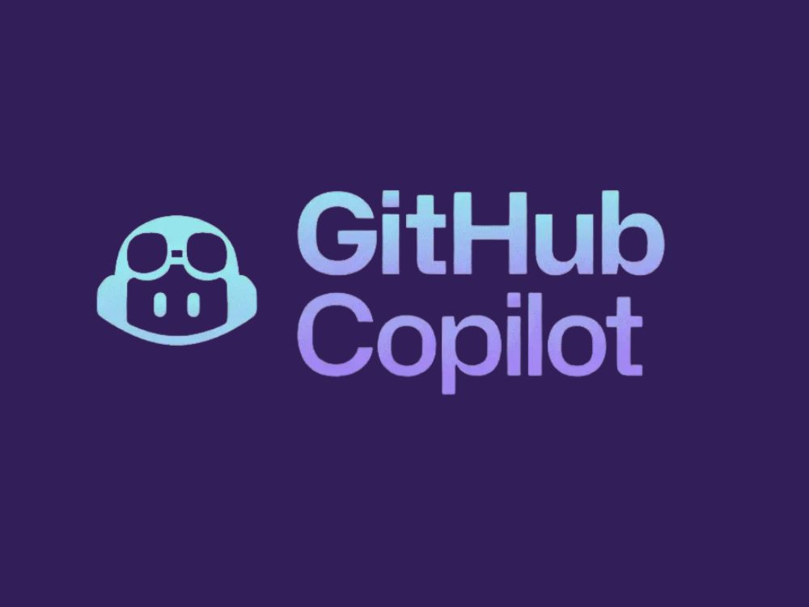

# GitHub Copilot Adoption



Use GitHub Copilot to deliver work your team needs. Choose from **31 challenges**
with starter code and track guides, or bring your own app. Use the session to
find practices your team can keep using.

Sessions use repository instructions, custom agents, and custom skills tailored
to the work. Challenge 30 adopts Spec Kit's supplied workflow; authoring custom
agents and skills is optional there.

In the other tracks, participants author **custom skills for reusable workflows**
and refine them throughout the session. Ordinary chat prompts remain useful for one-off requests.
Challenges **4, 8, 9, 10, 18, 27, 29, and 30** also use Impeccable for a focused
UI review tied to the existing user journey. Participants install the skill
with `npx`; no Impeccable extension is required. The
[shared setup](tracks/getting-started.md#5-install-impeccable-when-your-track-uses-it)
includes discovery and launcher checks. Each selected track keeps optional
features outside its 4-6-hour core.
The Backlog Generator's first stage is now
[Spec-to-Backlog Skill](tracks/challenge-15-backlog-generator-track/stage-1-skill.md);
links to its former `stage-1-prompt` page need updating.

## Two ways to run a GitHub Copilot Adoption delivery session

### Option 1: pick a worked-example challenge

Choose a challenge below. Each has a defined outcome, starter code, a
devcontainer, and stages that guide the work.

### Option 2: bring your own challenge

Use the **[Bring Your Own Challenge (BYOC) kit](./byoc/)** to plan a session on
your team's codebase. Define the result, prepare the work, and decide how you
will demonstrate it.

See **[byoc/README.md](./byoc/README.md)** for the full kit.

## Overview

The repository includes **31 challenge tracks** organized by the outcomes they help you deliver:

### Challenges by outcome

Choose by the work you need to deliver. At the end, show what changed and how
Copilot helped.

- 📋 **[Challenge 0: Product Planning Track](./tracks/challenge-0-product-planning-track.md)** - Product planning, backlog management, documentation (no code) | **Outcome:** Ship Product Features Faster
- 🔧 **[Challenge 1: Web API Track](./tracks/challenge-1-web-api-track.md)** - REST APIs, authentication, testing | **Outcomes:** Ship Product Features Faster, Raise Quality and Confidence
- 📊 **[Challenge 2: ML & AI Track](./tracks/challenge-2-ml-ai-track.md)** - Data analysis, ML models, feature engineering | **Outcome:** Build AI-Powered Capabilities
- ☁️ **[Challenge 3: DevOps Track](./tracks/challenge-3-devops-track.md)** - Infrastructure as Code, containers, CI/CD | **Outcomes:** Automate Delivery and Ops Toil, Stand Up Cloud Platform Foundations
- 🎨 **[Challenge 4: Frontend Track](./tracks/challenge-4-frontend-track.md)** - Accessible React dashboard, Impeccable design reviews (4-6 hours) | **Outcomes:** Ship Product Features Faster, Raise Quality and Confidence
- 🔍 **[Challenge 5: QA & Testing Track](./tracks/challenge-5-qa-track.md)** - AI-assisted testing, test planning, Copilot for QA workflows | **Outcome:** Raise Quality and Confidence
- 🧩 **[Challenge 6: Agentic Workflows Track](./tracks/challenge-6-agentic-workflows-track.md)** - Build AI-powered repository automation with GitHub Agentic Workflows | **Outcomes:** Automate Delivery and Ops Toil, Build AI-Powered Capabilities
- 🧩 **[Challenge 7: Copilot SDK Track](./tracks/challenge-7-copilot-sdk-track.md)** - Build a Copilot SDK application (advanced) | **Outcome:** Build AI-Powered Capabilities
- ✈️ **[Challenge 8: Flight Delay Predictor Track](./tracks/challenge-8-flight-delay-track.md)** - One model, API, and reviewed prediction UI (4-6 hours) | **Outcomes:** Ship Product Features Faster, Build AI-Powered Capabilities
- 🧩 **[Challenge 9: Cross-Functional Team Sprint](./tracks/challenge-9-team-sprint-track.md)** - Full team agile sprint, ideation to deployment (4-6 people) | **Outcome:** Ship Product Features Faster
- 🔧 **[Challenge 10: Technical Team Sprint](./tracks/challenge-10-tech-sprint-track.md)** - Technical team sprint from spec to deployment (2-4 developers) | **Outcome:** Ship Product Features Faster
- 🔧 **[Challenge 11: Legacy MUMPS Modernization](./tracks/challenge-11-mumps-modernization-track.md)** - Reverse-engineer and translate a MUMPS banking system (solo, advanced) | **Outcome:** Modernize Legacy Systems
- 🔧 **[Challenge 12: Legacy Code Modernization](./tracks/challenge-12-legacy-modernization-track.md)** - Reverse-engineer and modernize an undocumented Java application | **Outcome:** Modernize Legacy Systems
- 📋 **[Challenge 13: Living Documentation](./tracks/challenge-13-living-docs-track.md)** - Automate javadoc, diagrams, changelogs, and PR doc reviews | **Outcomes:** Raise Quality and Confidence, Automate Delivery and Ops Toil
- 🔧 **[Challenge 14: Pipeline Factory](./tracks/challenge-14-pipeline-factory-track.md)** - Build CI/CD pipelines, debug broken deployments, generate runbooks | **Outcome:** Automate Delivery and Ops Toil
- 📋 **[Challenge 15: Backlog Generator](./tracks/challenge-15-backlog-generator-track.md)** - Convert requirement specs into structured backlogs with MCP | **Outcomes:** Ship Product Features Faster, Automate Delivery and Ops Toil
- 🔧 **[Challenge 16: Ops Assistant](./tracks/challenge-16-ops-assistant-track.md)** - Build AI-assisted log analysis, incident routing, and ops tooling | **Outcome:** Automate Delivery and Ops Toil
- 🔧 **[Challenge 17: Spec-to-Ship Accelerator](./tracks/challenge-17-spec-to-ship-track.md)** - Full lifecycle from functional spec to deployed code | **Outcomes:** Ship Product Features Faster, Automate Delivery and Ops Toil
- 🔧 **[Challenge 18: COBOL Banking Modernization](./tracks/challenge-18-cobol-modernization-track.md)** - Characterize and modernize one COBOL transfer journey (4-6 hours) | **Outcome:** Modernize Legacy Systems
- 🔧 **[Challenge 19: WCF Banking Modernization](./tracks/challenge-19-wcf-modernization-track.md)** - Understand a legacy WCF SOAP banking service and migrate it to a REST API | **Outcome:** Modernize Legacy Systems
- 🔧 **[Challenge 20: PowerShell Automation](./tracks/challenge-20-powershell-automation-track.md)** - Fix, test, document, and package PowerShell scripts for real sysadmin work | **Outcomes:** Automate Delivery and Ops Toil, Modernize Legacy Systems
- ☁️ **[Challenge 21: Azure Terraform Track](./tracks/challenge-21-azure-terraform-track.md)** - Build an Azure Terraform foundation with modules, identity, policy checks, and CI guardrails | **Outcome:** Stand Up Cloud Platform Foundations
- 🔍 **[Challenge 22: Secure Release Review](./tracks/challenge-22-secure-release-track.md)** - Review and harden a .NET release candidate with evidence-based security gates | **Outcome:** Raise Quality and Confidence
- 🧩 **[Challenge 23: Merger Integration Architecture](./tracks/challenge-23-merger-architecture-track.md)** - Define Azure system boundaries, integration contracts, and transition decisions after a merger | **Outcome:** Stand Up Cloud Platform Foundations
- 📊 **[Challenge 24: Peak-Load Database Rescue](./tracks/challenge-24-database-rescue-track.md)** - Tune SQL Server safely and validate an Azure SQL-compatible migration | **Outcomes:** Raise Quality and Confidence, Stand Up Cloud Platform Foundations
- ☁️ **[Challenge 25: Enterprise API Guardrails](./tracks/challenge-25-api-guardrails-track.md)** - Govern APIs with Azure API Management policies, contract checks, and onboarding controls | **Outcomes:** Automate Delivery and Ops Toil, Stand Up Cloud Platform Foundations
- 📋 **[Challenge 26: Developer Onboarding Repair](./tracks/challenge-26-developer-onboarding-track.md)** - Repair task documentation and add checks for links, commands, and examples | **Outcomes:** Raise Quality and Confidence, Automate Delivery and Ops Toil
- 🎨 **[Challenge 27: Offline Field Service App](./tracks/challenge-27-offline-mobile-track.md)** - Build a dependable React Native workflow for intermittent connectivity | **Outcomes:** Ship Product Features Faster, Raise Quality and Confidence
- 📋 **[Challenge 28: Work IQ Workplace Assistant](./tracks/challenge-28-work-iq-workplace-assistant-track.md)** - Build a permission-aware workplace handoff using Microsoft Work IQ and GitHub Copilot CLI | **Outcomes:** Automate Delivery and Ops Toil, Ship Product Features Faster
- 🔧 **[Challenge 29: Inherit and Evolve an Application](./tracks/challenge-29-inherit-and-evolve-track.md)** - Understand a working .NET equipment-booking app, fix a cancellation defect, and add a waitlist | **Outcomes:** Ship Product Features Faster, Raise Quality and Confidence
- 🔧 **[Challenge 30: Spec-Driven Feature Delivery with GitHub Spec Kit](./tracks/challenge-30-spec-driven-track.md)** - Use Spec Kit and Copilot CLI to add approvals, then revise the feature when requirements change | **Outcomes:** Ship Product Features Faster, Raise Quality and Confidence

**[View All Tracks & Choose Yours](./tracks/README.md)**

Coaches who need a focused workshop path can use the site's Challenge Set Builder and Learning Paths pages to select challenges and generate a single shareable student URL.

Each track explains its stages and verification criteria.

The documentation site also groups challenges into 13 enterprise Role
Collections. Use the **Roles** page to find relevant work for product,
engineering, data, security, database, documentation, mobile, platform,
operations, QA, and architecture roles.

## Duration

Duration varies by track. Challenge 29 takes **4-6 hours**, with a five-hour core.
Check the selected track for its time budget.

## Documentation site

The static documentation site lives in `web/`. It uses HTML, CSS, and JavaScript
with no build dependencies.

To build the site data locally:

```bash
node web/build.js
```

This reads `challenges/*/meta.yml`, `learning-paths.json`,
`role-collections.json`, and track markdown files, then writes the site data to
`web/assets/data/`.

Role Collections are curated challenge groups, not required sequences.
`role-collections.json` is their source of truth. The build rejects unknown
challenge IDs, duplicate role entries, empty collections, and challenges that
are not assigned to any role.

Each challenge is published as a set of pages rather than one concatenated guide:

- The track file becomes the main overview.
- The committed `stages.md` file becomes the contents page.
- Each stage has its own page.
- Challenges with role-specific instructions include those pages beneath their
  parent stage.

The challenge page shows this structure in a right-side **Challenge pages**
menu. Every page has a direct URL in the form
`challenge.html?id=<id>&page=<page-id>`.

The generated `platform.json` catalog includes the page manifest for each
challenge. Markdown payloads are written separately under
`web/assets/data/challenges/<id>/pages/<page-id>.md`.

To preview locally:

```bash
cd web
python3 -m http.server
```

Then open `http://localhost:8000/index.html` in your browser.

The GitHub Pages deployment workflow automatically builds and deploys the site from `.github/workflows/deploy-site.yml` on every push to `main`.

## Getting started

### Option 1: work a challenge track

1. Choose a challenge from [tracks/README.md](./tracks/README.md).
2. Set up your environment using the track's prerequisites and devcontainer.
3. Work through the stages and demonstrate the result.

**Use a disposable clone for a predefined challenge.** First-time setup keeps
the selected starter and guides, removes the website and facilitator material,
and replaces the root README with a single challenge entry point. Rebuilding
preserves participant files and Copilot customizations. The full template and
BYOC kit remain in this source repository.

### Option 2: bring your own challenge

1. **Define your outcome** using the **[Outcome Canvas](./byoc/outcome-canvas.md)**.
2. **Author your challenge** using the templates in **[byoc/templates/](./byoc/templates/)** (if you need a custom progression; otherwise skip this and work directly on your app).
3. **Run your session** following the **[BYOC Facilitator Runbook](./byoc/facilitator-runbook.md)**.
4. **Measure success** using the **[Outcome Scorecard](./byoc/outcome-scorecard.md)**.

See the **[BYOC Kit README](./byoc/README.md)** for the end-to-end flow and a worked example.

---

### Step 1: choose your track

**Not sure which track?** See the **[Track Selection Guide](./tracks/README.md)** for help choosing.

**Running a coached session?** Use the site's Challenge Set Builder or Learning Paths pages to prepare a curated challenge set and share one student URL with participants.

### Step 2: set up environment

#### Prerequisites

- GitHub account with Copilot access
- GitHub Codespaces enabled (recommended) OR
- Local development environment with VS Code and GitHub Copilot extension

#### Open the workspace

**Option A: GitHub Codespaces (Recommended)**

1. Click the green **"Code"** button at the top of this repository.
2. Select the **"Codespaces"** tab.
3. Click **"Create codespace on main"**.
4. Wait for the environment to set up (2-3 minutes).

**Option B: Local Development**

1. Clone this repository:

   ```bash
   git clone https://github.com/microsoft/frontier-ghcp-rvas.git
   cd frontier-ghcp-rvas
   ```

2. Open the folder in VS Code.
3. When prompted, click **"Reopen in Container"** (requires Docker and Dev Containers extension).

The environment is pre-configured with:

- Node.js (LTS)
- Python 3.11
- Docker
- Terraform
- kubectl
- All necessary VS Code extensions

### Step 3: prepare your challenge workspace

If you opened the selected challenge's devcontainer, setup has already prepared
the workspace. Follow the challenge link in the generated root README.

For manual setup, follow
[Getting Started](./tracks/getting-started.md#manual-setup-without-a-devcontainer).
First-time setup resets the template's Copilot customizations and detaches its
git remote. Repeating setup for the same challenge preserves your work.

**Do not run `clean-start` after you begin.** It resets Copilot customizations,
including installed skills.

### Step 4: verify your setup

Before starting, make sure Copilot is working:

**Check Copilot Status:**

- Look at the bottom-right of VS Code
- Copilot icon should be visible and say "Ready"

**Test Inline Suggestions:**

1. Create a new file (e.g., `test.js`)
2. Type: `// function to add two numbers`
3. Check that Copilot suggests code.

**Test Chat:**

1. Press `Ctrl+Shift+I` (Windows/Linux) or `Cmd+Shift+I` (Mac)
2. Type: "Hello, are you working?"
3. Check that Copilot responds.

### Step 5: start your track

Once your environment is ready:

1. Open your chosen track guide (e.g., `tracks/challenge-1-web-api-track.md`)
2. Follow the recommended challenge sequence
3. Use the track-specific tips and guidance

## Skills you'll build while driving outcomes

The challenges give you practice with these Copilot capabilities:

### 1. Chat and agentic capabilities

- `/explain`, `/fix`, `/tests` commands
- **Agentic Mode** - Autonomous multi-step task execution
- **Planning Mode** - High-level architectural reasoning
- Workspace context chat

### 2. Repository Instructions

- Stable project context and constraints
- Coding, testing, and review conventions
- Mid-session refinement based on what the team learns

### 3. Custom Agents and skills

- **MCP Servers** - Connect external tools and data
- **Custom Agents** - Build and use specialized assistants
- **Custom Skills** - Capture repeatable workflows

### 4. Inline suggestions

- Code completion
- Multi-line suggestions
- Ghost text navigation

## Challenges

Use the [track catalog](./tracks/README.md) to choose by role or outcome.

All 31 challenges are available, and each track has a dedicated challenge:

### [Challenge 0: Product Planning -- TaskFlow v2.0](./challenges/challenge-0-product-planning/) ([Track](./tracks/challenge-0-product-planning-track.md))

**Team**: Product Owners, Business Analysts, Project Managers
**Skills**: Markdown, GitHub Issues, GitHub Projects, Pull Requests
**Copilot Focus**: Long-form writing, brainstorming, GitHub MCP server for issue/PR management

Plan the next release of a task management platform in five stages. Analyze
competitors and define personas with measurable needs. Write and review user
stories, then build feature specs aligned to real API endpoints. Resolve
conflicting stakeholder requests within a fixed budget. Finish with a release
plan that covers risk, rollback, and monitoring. No application code is required.

---

### [Challenge 1: Web Development - REST API Builder](./challenges/challenge-1-web-api/) ([Track](./tracks/challenge-1-web-api-track.md))

**Team**: Backend/Web Developers
**Skills**: Express.js/FastAPI, API design, error handling, testing
**Copilot Focus**: Inline completion, `/tests` command, workspace chat

Build a task management REST API across 5 progressive stages: basic CRUD, JWT authentication with role-based access, SQLite persistence with data relationships, debugging a broken v2 API module (3 intentional bugs), and production readiness with load testing, caching, and structured logging.

---

### [Challenge 2: ML/AI - Data Analysis & Model Development](./challenges/challenge-2-ml-ai/) ([Track](./tracks/challenge-2-ml-ai-track.md))

**Team**: Data Scientists, ML Engineers
**Skills**: Python, pandas, scikit-learn, data visualization
**Copilot Focus**: Jupyter notebooks integration, `/explain` for algorithms, code generation

Predict customer churn across 5 stages: discover 7+ hidden data quality issues, create visualizations with statistical hypothesis testing, train models with cost-sensitive evaluation using sklearn Pipelines, compare imbalance techniques with SHAP interpretability, and deploy a prediction API with drift detection and a model card.

---

### [Challenge 3: DevOps - Infrastructure as Code](./challenges/challenge-3-devops/) ([Track](./tracks/challenge-3-devops-track.md))

**Team**: DevOps, Platform Engineers
**Skills**: Terraform, Docker, Kubernetes, CI/CD
**Copilot Focus**: Infrastructure patterns, documentation generation, best practices

Build infrastructure for a Node.js app across 5 stages: multi-stage Dockerfile with Docker Compose, Kubernetes with HPA and NetworkPolicy, Terraform for Azure (ACR, AKS) with variables and remote state, debug a broken Key Vault module and add observability, then create a CI/CD pipeline with blue/green deployment and a DR runbook.

---

### [Challenge 4: Frontend - Interactive UI Components](./challenges/challenge-4-frontend/) ([Track](./tracks/challenge-4-frontend-track.md))

**Team**: Frontend Developers
**Skills**: React, TypeScript, Component design, State management
**Copilot Focus**: Component scaffolding, TypeScript types, CSS styling

Build an accessible task dashboard with validated CRUD and delete undo. Use
Impeccable for a critique-and-fix cycle, then connect a mocked API and test the
task flow. Drag-and-drop, offline support, and Storybook are optional.

---

### [Challenge 5: QA & Test Automation](./challenges/challenge-5-qa/) ([Track](./tracks/challenge-5-qa-track.md))

**Team**: QA Engineers, Quality Assurance Specialists, Manual Testers
**Skills**: Test planning, test case design, bug reporting (no coding experience required)
**Copilot Focus**: AI-assisted test generation, Playwright MCP exploration, Copilot-driven debugging

Test the eShop application across 5 stages: explore the app with Copilot and Playwright MCP to build a test plan, use Copilot to debug and generate your first automated tests, expand coverage across browsers with Copilot-generated page objects, compare AI-driven vs human-guided testing approaches, then build reporting and a test strategy document.

---

### [Challenge 7: Copilot SDK -- Release Notes Agent](./challenges/challenge-7-copilot-sdk/) ([Track](./tracks/challenge-7-copilot-sdk-track.md))

**Team**: Experienced developers (any role) who finished a standard track
**Duration**: 8-12 hours (Advanced)
**Skills**: Node.js, TypeScript, Copilot SDK, GitHub API, custom tool definitions
**Copilot Focus**: Build with the Copilot agent runtime using sessions, streaming, custom tools, and MCP integration

Build a Release Notes Agent with the GitHub Copilot SDK. It fetches merged PRs
and categorizes changes. Refine the changelog through conversation, then publish
a draft GitHub Release. Use custom tools, streaming responses, and multi-turn
sessions.

> ⚠️ **Challenge 7 is significantly harder and longer than the standard challenges.**

---

### [Challenge 8: Full-Stack Flight Delay Predictor](./challenges/challenge-8-flight-delay/) ([Track](./tracks/challenge-8-flight-delay-track.md))

**Team**: Full-Stack Developers, Advanced Participants
**Duration**: 4-6 hours (five-hour core)
**Skills**: Python, pandas, scikit-learn, Flask/FastAPI, TypeScript, frontend frameworks
**Copilot Focus**: Data science in notebooks, API and frontend generation, debugging across the stack

Build one baseline flight-delay model, serve it through a REST API, and create a
frontend where users select a day and airport. Use Impeccable to improve the
prediction flow while keeping probability wording accurate. Extra models,
charts, and Azure deployment are optional.

---

### [Challenge 9: Cross-Functional Team Sprint (CityPulse)](./challenges/challenge-9-team-sprint/) ([Track](./tracks/challenge-9-team-sprint-track.md))

**Team**: Cross-functional team of 4-6 (Product Owner, Backend Dev, Frontend Dev, QA, DevOps, optional BA)
**Duration**: 4-6 hours (five-hour team core)
**Skills**: GitHub Spark, GitHub Issues/Projects, Express.js/FastAPI, React/Vue, Playwright, Docker, Azure, Terraform
**Copilot Focus**: PO planning and user stories, developer code generation, QA test automation, DevOps infrastructure

Build CityPulse as a cross-functional team. The core covers reports and upcoming
events, with an integrated API and tests. Use Impeccable for one QA-verified UI
improvement and finish with a tested demo. Dashboard analytics and Azure
deployment without a prepared environment are optional.

> This challenge requires a team. It is not designed for solo participants.

---

### [Challenge 10: Technical Team Sprint (TrailMate)](./challenges/challenge-10-tech-sprint/) ([Track](./tracks/challenge-10-tech-sprint-track.md))

**Team**: Technical team of 2-4, with Backend Dev, Frontend Dev, and DevOps responsibilities. QA is optional; no PO or BA is required.
**Duration**: 4-6 hours (five-hour team core)
**Skills**: Express.js/FastAPI, React/Vue, Playwright, Docker, Azure, Terraform, GitHub Issues/Projects
**Copilot Focus**: Developer code generation, QA test automation, DevOps infrastructure

Build TrailMate from the provided specification. The core covers trail browsing
and condition reporting, with API integration and tests. Use Impeccable to
improve status and warning clarity. Finish with a tested demo; analytics and
Azure deployment without a prepared environment are optional.

> This challenge requires a team. It is not designed for solo participants.

---

### [Challenge 11: Legacy MUMPS Modernization](./challenges/challenge-11-mumps-banking/) ([Track](./tracks/challenge-11-mumps-modernization-track.md))

**Team**: Solo or pair (any developer role)
**Duration**: 8-12 hours (Advanced)
**Skills**: Any modern language (PSL, Java, Python, C#, TypeScript), reverse engineering, testing, financial domain knowledge
**Copilot Focus**: Legacy code comprehension with `/explain`, cross-language translation, characterization test generation, architecture documentation

Reverse-engineer a MUMPS banking system with 12 routines and about 2,500 lines
of code. It handles customers, deposit accounts, teller transactions, consumer
loans, interest, and end-of-day batches. Test and extend the system, then
translate it to a modern language while preserving its business rules.

---

### [Challenge 12: Legacy Code Modernization](./challenges/challenge-12-legacy-modernization/) ([Track](./tracks/challenge-12-legacy-modernization-track.md))

**Team**: Solo or pair (Java developers)
**Duration**: 6-8 hours
**Skills**: Java 8/17, Spring Boot, Maven, REST APIs, SQL
**Copilot Focus**: Legacy code comprehension with `/explain`, security auditing, characterization testing, framework migration

Modernize the Acme Bank Account Manager, an undocumented Java 8 / Spring Boot
1.5 application whose contractor left in 2018. It has SQL injection
vulnerabilities and deprecated libraries, including Log4j 1.x and Apache
HttpClient 4.x. Business logic lives in controllers, with no service layer or
tests. Recover the business rules, audit security, and write characterization
tests before migrating to Spring Boot 3.x / Java 17+.

---

### [Challenge 13: Living Documentation](./challenges/challenge-13-living-docs/) ([Track](./tracks/challenge-13-living-docs-track.md))

**Team**: Solo or pair (Java developers, tech leads)
**Duration**: 6-8 hours
**Skills**: Java, Javadoc, Mermaid diagrams, Markdown
**Copilot Focus**: Bulk javadoc generation, architecture diagrams, changelog workflow skills, custom agents for PR documentation review

Update the Widget Corp Inventory Manager's stale javadoc and changelog, which
stopped two versions ago. Add Mermaid diagrams for the architecture and data
model. Build a repeatable changelog workflow and an agent that reviews PRs for
missing documentation.

---

### [Challenge 14: Pipeline Factory](./challenges/challenge-14-pipeline-factory/) ([Track](./tracks/challenge-14-pipeline-factory-track.md))

**Team**: Solo or pair (DevOps, platform engineers, developers)
**Duration**: 6-8 hours
**Skills**: GitHub Actions, Node.js, Shell scripting, CI/CD concepts
**Copilot Focus**: Workflow generation, `/fix` for debugging broken deployments, reusable workflow design, incident runbook skills

Build CI/CD pipelines for TaskBoard, a kanban app that currently deploys via a shell script with commented-out scp commands. Create GitHub Actions workflows, debug 5 deliberate bugs in a broken staging deployment, build reusable workflow templates, and generate deployment gates with rollback mechanisms and incident runbooks.

---

### [Challenge 15: Backlog Generator](./challenges/challenge-15-backlog-generator/) ([Track](./tracks/challenge-15-backlog-generator-track.md))

**Team**: Solo or pair (product owners, tech leads, scrum masters)
**Duration**: 6-8 hours (no code required)
**Skills**: Agile concepts (Epics, Stories, Acceptance Criteria), Jira/Confluence (optional)
**Copilot Focus**: Spec-to-backlog workflow skills, custom agents for refinement, Atlassian Rovo MCP server for Jira/Confluence integration

Convert three use case specifications of increasing complexity (Password Reset, Notification Preferences, Inventory Reorder) into structured backlogs. Build a reusable skill that produces Epics, Stories, Tasks, and Test Cases following INVEST criteria. Create a refinement agent that reviews generated backlogs for gaps. Optionally push items directly to Jira using the Atlassian MCP server.

---

### [Challenge 16: Ops Assistant](./challenges/challenge-16-ops-assistant/) ([Track](./tracks/challenge-16-ops-assistant-track.md))

**Team**: Solo or pair (support engineers, SREs, ops teams)
**Duration**: 6-8 hours
**Skills**: Log analysis concepts, incident management, basic Node.js (optional)
**Copilot Focus**: Custom agents for log analysis, incident routing and runbook workflow skills, error-to-plain-language translation

Build operations tooling for the Order Gateway e-commerce service. Analyze two
days of logs containing payment timeouts, database deadlocks, connection pool
exhaustion, and OutOfMemoryErrors. Create an agent that explains errors to
non-technical support staff. Build an incident routing skill that maps errors
to responsible teams, then generate runbooks from historical incident data.

---

### [Challenge 17: Spec-to-Ship Accelerator](./challenges/challenge-17-spec-to-ship/) ([Track](./tracks/challenge-17-spec-to-ship-track.md))

**Team**: Solo or pair (tech leads, senior developers)
**Duration**: 6-8 hours
**Skills**: Full SDLC concepts, Node.js, GitHub Actions
**Copilot Focus**: Workflow skills for specifications, backlogs, technical analysis, implementation, tests, and CI; custom agents for test specifications

Deliver a billing module for an existing multi-tenant SaaS platform. Start
with its functional requirements and tenant management API. Build skills that
convert the spec into work items and support each handoff. Analyze the existing
code, implement the stories, and use a custom agent to create test
specifications. Finish with a CI pipeline.

---

### [Challenge 18: COBOL Banking Modernization](./challenges/challenge-18-cobol-banking/) ([Track](./tracks/challenge-18-cobol-modernization-track.md))

**Team**: Solo or pair (any developer role)
**Duration**: 4-6 hours (five-hour core)
**Skills**: COBOL (no prior experience needed), Node.js/TypeScript or Java, React, reverse engineering, testing
**Copilot Focus**: Legacy code comprehension with `/explain`, cross-language translation, characterization test generation, full-stack modernization

Trace and characterize one COBOL account-transfer workflow, then expose it
through a local API and React UI. Use Impeccable to review the teller journey
without changing characterized behavior. Full-system translation and new
banking features are optional.

---

### [Challenge 19: WCF Banking Modernization](./challenges/challenge-19-wcf-banking/) ([Track](./tracks/challenge-19-wcf-modernization-track.md))

**Team**: Solo or pair (.NET developer)
**Duration**: 6-10 hours (Intermediate to Advanced)
**Skills**: C#, WCF/SOAP concepts, ASP.NET Core Web API, REST design, xUnit
**Copilot Focus**: SOAP service contract comprehension, fault contract analysis, REST migration, characterization testing

Reverse-engineer a legacy WCF banking service (Meridian Savings Bank) built circa 2010-2012, now running on CoreWCF and .NET 8. Understand the service contracts, data contracts, and fault conditions, then port the business logic to a REST API using ASP.NET Core Web API. The service has real bugs to find and real decisions to make about whether to preserve or fix them during migration.

---

### [Challenge 20: PowerShell Automation](./challenges/challenge-20-powershell-automation/) ([Track](./tracks/challenge-20-powershell-automation-track.md))

**Team**: Solo (sysadmin or IT Pro)
**Duration**: 4-6 hours (Intermediate)
**Skills**: PowerShell 7+, Pester 5, PSScriptAnalyzer, Az module, GitHub Actions
**Copilot Focus**: Script comprehension, bug detection, error handling, test generation, module packaging, CI pipeline creation

Repair three inherited PowerShell scripts from the fictional Contoso IT team.
They find stale accounts, clean disks, and tag Azure resources. Fix their bugs,
add error handling and logging, and write Pester tests. Run static analysis
and add a GitHub Actions CI pipeline.

---

### Challenge 21: Azure Terraform Foundation ([Track](./tracks/challenge-21-azure-terraform-track.md))

**Team**: Platform Engineers, DevOps Engineers, Cloud Engineers
**Skills**: Terraform, Azure networking, managed identity, Key Vault, GitHub Actions
**Copilot Focus**: Infrastructure review, plan explanation, module extraction, CI workflow generation

Build an Azure Terraform foundation across 5 stages: bootstrap remote state and naming rules, provision a small Azure platform around Container Apps, wire managed identity and Key Vault, refactor the configuration into reusable modules for multiple environments, then add CI guardrails and a drift response runbook.

---

### [Challenge 22: Secure Release Review](./challenges/challenge-22-secure-release/) ([Track](./tracks/challenge-22-secure-release-track.md))

**Team**: Application security engineers, senior .NET developers, technical leads, platform engineers
**Duration**: 4-6 hours
**Skills**: .NET 8, threat modeling, authorization review, security testing, release evidence
**Copilot Focus**: Code review, targeted remediation, regression tests, evidence-based release decisions

Review a .NET 8 payments API before release. Trace trust boundaries, prioritize security findings, prove targeted fixes with tests, review dependencies and secrets, and finish with a defensible release checklist.

---

### [Challenge 23: Merger Integration Architecture](./challenges/challenge-23-merger-architecture/) ([Track](./tracks/challenge-23-merger-architecture-track.md))

**Team**: Solution architects, enterprise architects, integration leads, technical program leads
**Duration**: 4-6 hours
**Skills**: Azure architecture, system boundaries, API and event contracts, ADRs, transition planning
**Copilot Focus**: Evidence analysis, architecture options, contract review, migration risk

Design an Azure integration foundation for two companies after a merger. Resolve conflicting system evidence, define capability ownership and contracts, record key decisions, and sequence a transition without a big-bang cutover.

---

### [Challenge 24: Peak-Load Database Rescue](./challenges/challenge-24-database-rescue/) ([Track](./tracks/challenge-24-database-rescue-track.md))

**Team**: Database administrators, database reliability engineers, data platform engineers
**Duration**: 4-6 hours
**Skills**: SQL Server, Azure SQL, T-SQL, execution plans, safe schema migration
**Copilot Focus**: Query evidence, tuning review, migration safety, operational runbooks

Diagnose a SQL Server workload under peak load, reduce measured query cost, and ship a backward-compatible schema change. The required checks run locally, with Azure SQL available as an optional target validation.

---

### [Challenge 25: Enterprise API Guardrails](./challenges/challenge-25-api-guardrails/) ([Track](./tracks/challenge-25-api-guardrails-track.md))

**Team**: API platform engineers, Azure platform engineers, technical leads, developer experience engineers
**Duration**: 4-6 hours
**Skills**: OpenAPI, Azure API Management, Microsoft Entra ID, contract checks, observability
**Copilot Focus**: Contract comparison, lifecycle review, policy validation, platform onboarding

Create a governed path for teams publishing APIs through Azure API Management. Compare inconsistent contracts, define standards and exceptions, test policies locally, and document the onboarding evidence required for platform review.

---

### [Challenge 26: Developer Onboarding Repair](./challenges/challenge-26-developer-onboarding/) ([Track](./tracks/challenge-26-developer-onboarding-track.md))

**Team**: Technical writers, developer educators, developer experience practitioners, engineers
**Duration**: 4-6 hours
**Skills**: Markdown, information architecture, reader testing, Node.js documentation checks
**Copilot Focus**: Documentation diagnosis, technical accuracy, example verification, editorial review

Repair fragmented onboarding for a working CLI and SDK. Test real reader journeys, settle terminology and page boundaries, correct examples against the software, and add lightweight checks that keep the guidance usable.

---

### [Challenge 27: Offline Field Service App](./challenges/challenge-27-offline-mobile/) ([Track](./tracks/challenge-27-offline-mobile-track.md))

**Team**: Mobile developers, frontend engineers, test engineers, technical leads
**Duration**: 4-6 hours
**Skills**: React Native, Expo, TypeScript, offline persistence, synchronization testing
**Copilot Focus**: State-flow tracing, failure analysis, mobile accessibility, release evidence

Make a React Native field-service workflow dependable when connectivity and device permissions fail. Preserve technician work across restarts, define conflict behavior, test degraded modes, and verify the mocked Azure Functions synchronization contract.

---

### [Challenge 28: Work IQ Workplace Assistant](./challenges/challenge-28-work-iq-workplace-assistant/) ([Track](./tracks/challenge-28-work-iq-workplace-assistant-track.md))

**Team**: Delivery leads, technical leads, developers, information governance partners
**Duration**: 4-6 hours
**Skills**: Microsoft Work IQ, GitHub Copilot CLI, Microsoft Entra ID, Microsoft 365, evidence review
**Copilot Focus**: Permission-aware retrieval, evidence mapping, handoff drafting, human approval gates

Build a reviewed project handoff from approved Microsoft 365 context. Retrieve a narrow set of meetings, messages, emails, or documents, create an evidence-backed action register, and keep all write actions behind human approval.

---

### [Challenge 29: Inherit and Evolve an Application](./challenges/challenge-29-inherit-and-evolve/) ([Track](./tracks/challenge-29-inherit-and-evolve-track.md))

**Team**: C# developers, full-stack engineers, QA engineers, technical leads
**Duration**: 4-6 hours
**Skills**: ASP.NET Core, SQLite, code comprehension, regression testing
**Copilot Focus**: Tracing unfamiliar code, investigating defects, adding features safely

Take over a working equipment-booking app. Verify how it behaves, fix a reported
cancellation defect, then add a waitlist through the UI and backend. The starter
includes seeded data and passing baseline tests, plus an application Dockerfile
and a dedicated devcontainer.
The Challenge 29 workflow runs the starter tests and checks application-container
startup and restart when its code changes.

---

### [Challenge 30: Spec-Driven Feature Delivery with GitHub Spec Kit](./challenges/challenge-30-spec-driven/) ([Track](./tracks/challenge-30-spec-driven-track.md))

**Team**: Developers, QA engineers, technical leads
**Duration**: 4-6 hours
**Skills**: TypeScript, HTTP APIs, acceptance testing, specification review
**Copilot Focus**: Spec Kit's supplied workflow in Copilot CLI, from clarification to verified code

Add approvals to a working service-request app, then introduce a second approval
for high-cost requests. Keep the same feature specification current through the
change. The starter includes a browser UI and baseline tests; participants
implement the approval rules. No deployment or external issue tracker is needed.

---

## Learning resources

### Examples and templates

Use the [shared examples guidance](./tracks/getting-started.md#4-learn-from-examples-then-write-your-own)
to find current examples. Search for terms that match the artifact you need,
such as "repository instructions", "custom agent", or "workflow skill".

### GitHub Copilot documentation

- [Copilot Guide](./docs/copilot-guide.md)
- [Prompt Engineering Guide](./docs/prompt-engineering.md)
- [MCP Servers Guide](./docs/mcp-servers.md)

### Quick tips

Describe the expected behavior and reference existing code. Refine suggestions
through conversation, and review generated code before accepting it.
Use `/explain`, `/fix`, and `/tests` for focused requests.

| Shortcut | Action |
|----------|--------|
| `Tab` | Accept suggestion |
| `Esc` | Dismiss suggestion |
| `Alt+]` | Next suggestion |
| `Alt+[` | Previous suggestion |
| `Ctrl+Shift+I` | Open Copilot Chat |

### Tips for success

1. **Write Clear Comments**

   ```javascript
   // ❌ Bad: "do stuff"
   // ✅ Good: "Validate email format and return true if valid, false otherwise"

   ```

2. Ask Copilot to explain code you do not understand.
3. Review generated code and test its behavior.
4. Refine your request when a suggestion misses the requirements.

### Common issues

| Problem | Solution |
|---------|----------|
| Copilot not suggesting | Check status icon, ensure signed in, restart VS Code |
| Wrong suggestions | Be more specific, provide more context, try chat instead |
| Environment issues | Codespaces: rebuild container; Local: check tool versions |

## Session format

### Track-based learning

**Choose a track** based on your role and follow the curated path:

- Each track provides a recommended sequence of challenges
- Track-specific tips and guidance
- Clear learning objectives
- Estimated time for completion

See **[Tracks Overview](./tracks/README.md)** to choose your path.

### Alternative: individual challenges

Choose challenges based on your interests. Each includes starter code and
objectives, with optional tasks for further work.

### Team demos (1-2 hours)

- Present your solutions
- Share interesting Copilot interactions
- Discuss productivity gains and learnings
- Compare experiences across different tracks

### Best practices session (1 hour)

- Review common patterns
- Share tips and tricks discovered
- Q&A with Copilot experts

## Success metrics

Each team should demonstrate its result and explain the impact, such as time
saved or risk reduced. Record how Copilot helped and which practices the team
will use in daily work.

Copilot usage and chat counts can support that evidence. **Judge success by
the work delivered**, not tool activity.

## Collaboration

- Use GitHub Issues to ask questions
- Share discoveries in Discussions
- Help teammates learn new Copilot features
- Document your journey in your challenge folders

## Feedback

After completing the session, please share:

- What worked well
- What could be improved
- Productivity improvements you experienced
- Features you found most valuable

## Next steps

After the session:

1. Apply Copilot to your daily work
2. Explore advanced features and settings
3. Refine your team's repository instructions, custom agents, and custom skills
4. Share knowledge with your organization
5. Measure and track productivity improvements

## Support and resources

### Quick links

- **[Choose Your Track](./tracks/README.md)** - Outcome-driven learning paths organized by role and outcome
- **[Bring Your Own Challenge Kit](./byoc/README.md)** - Run a GitHub Copilot Adoption delivery session on your own codebase
- **Challenge Set Builder** - Available on the published site; coaches can curate challenge sets and generate student URLs
- **[Troubleshooting Guide](./TROUBLESHOOTING.md)** - Common issues and solutions
- **[Facilitator Guide](./FACILITATOR_GUIDE.md)** - For GitHub Copilot Adoption delivery session organizers
- **[Contributing Guide](./CONTRIBUTING.md)** - Help improve this content

### Help

Use the [Track Selection Guide](./tracks/README.md) to choose a challenge and
the [Troubleshooting Guide](./TROUBLESHOOTING.md) for setup problems.
Report bugs through this repository's issues.
